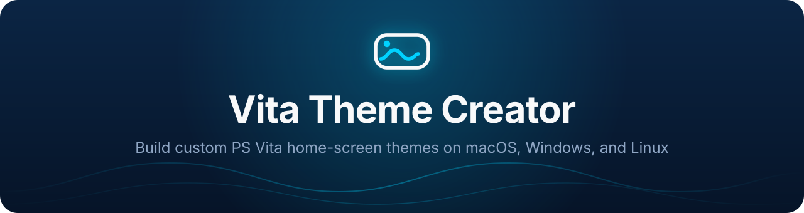
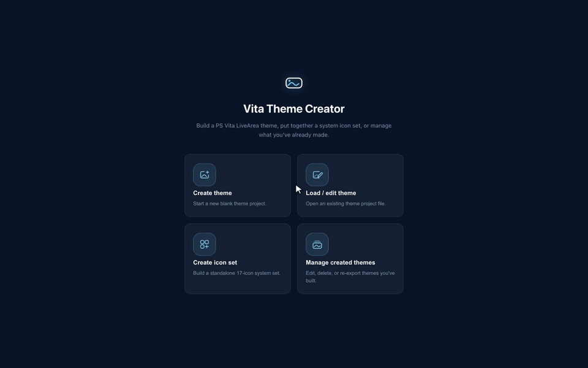
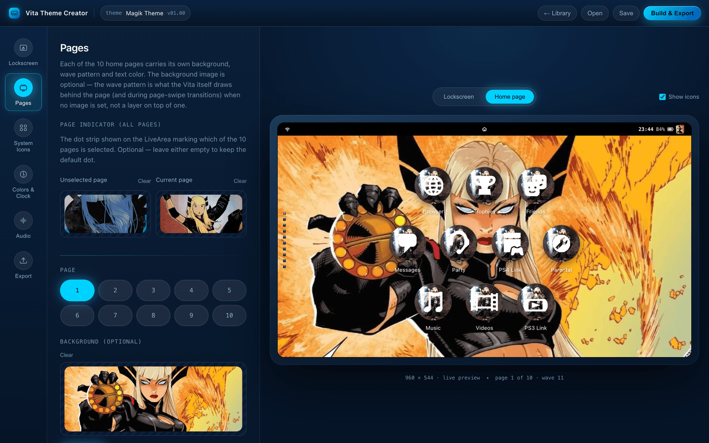
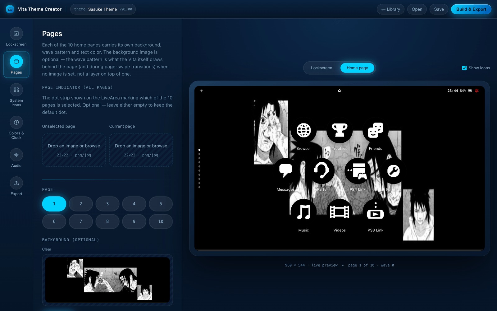
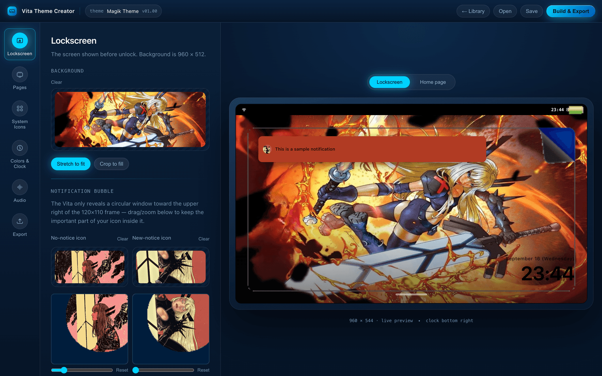
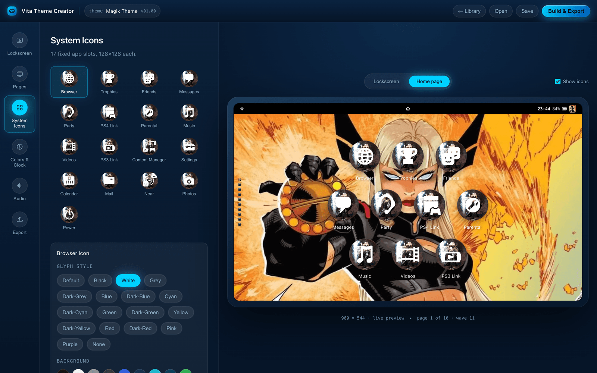
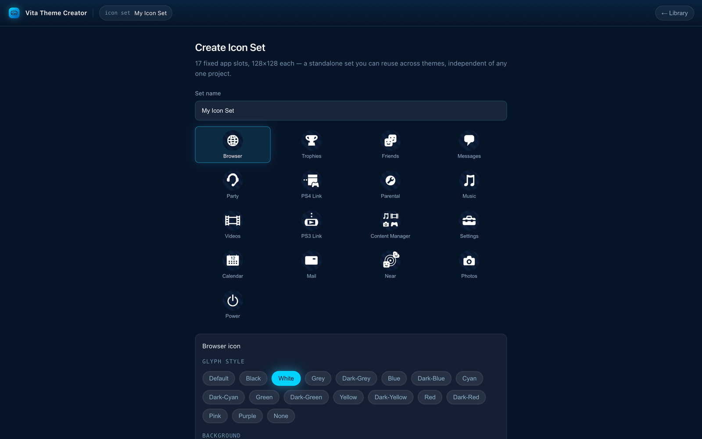
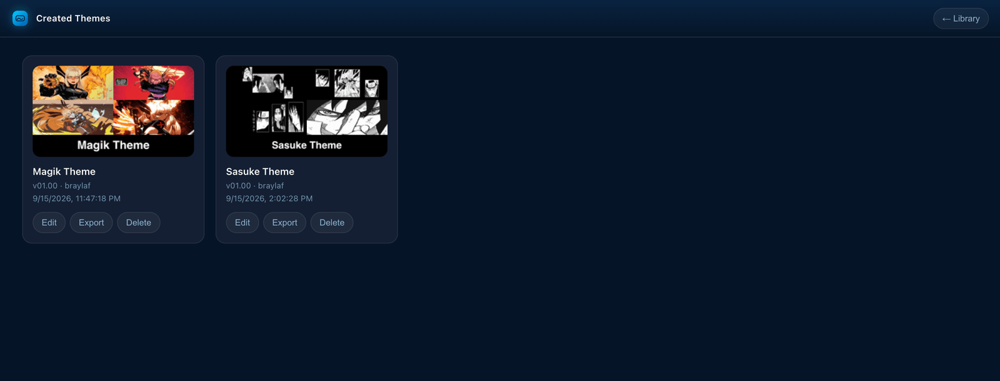
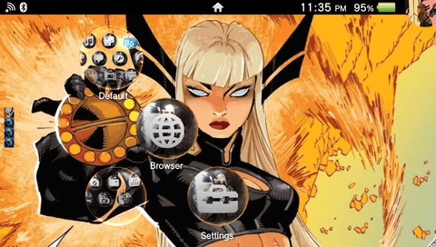
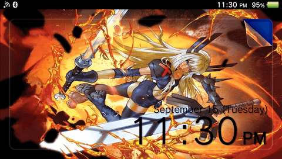

<p align="center">
  
</p>

<p align="center">
  <a href="https://github.com/BrayLaf/VitaThemeCreator/releases/latest"></a>
  
  
  
  
</p>

<p align="center">
  <a href="#features">Features</a> ·
  <a href="#screenshots">Screenshots</a> ·
  <a href="#themes-made-with-it">Themes made with it</a> ·
  <a href="#getting-started">Getting started</a> ·
  <a href="#how-accurate-is-it">Accuracy</a> ·
  <a href="#project-structure">Project structure</a> ·
  <a href="#credits">Credits</a>
</p>

---

**Vita Theme Creator** is a desktop app for building custom home-screen themes
for the PlayStation Vita. It's a modern, cross-platform reimplementation of
[**ThemeBUILDER**](https://github.com/AntHJ/ThemeBUILDER) by
[AntHJ](https://github.com/AntHJ), a Windows-only PySimpleGUI tool. This app
exists because of ThemeBUILDER: its reverse-engineering of the Vita theme
format (image sizes, the `theme.xml` schema, icon slots, audio encoding,
packaging layout) is the foundation everything here is built on. Full credit
to AntHJ.

<p align="center">
  
</p>

## Features

- **Live, Vita-accurate preview.** The lockscreen and each home page render as
  you edit, including the status bar, wave-pattern backgrounds, and system
  icons. The preview was checked against real exported themes and device
  screenshots.
- **Full theme editor.** Edit the lockscreen, all 10 home pages, 17 system
  icons, clock and notification colors, background music, and package info,
  all through native file pickers.
- **Crop or stretch any image.** Drag to pan and scroll to zoom. The editor,
  the preview, and the export share the same crop math, so the exported image
  matches what you see.
- **More customization than the original.** You can use your own
  page-indicator dots, and you can replace the lockscreen and LiveArea
  preview screenshots independently.
- **Standalone icon-set builder.** Build a reusable 17-icon set without
  opening a theme.
- **Theme library.** List, reopen, re-export, or delete every theme you've
  built.
- **Real, installable output.** Export produces correctly sized PNGs, a
  generated `theme.xml`, composited icons, an ATRAC9 `bgm.at9`, and a `.zip`
  laid out the way the community themes repository expects.
- **Export doesn't fail on empty slots.** Every optional image falls back to
  ThemeBUILDER's own bundled defaults.

## Screenshots

<table>
  <tr>
    <td width="50%" valign="top"></td>
    <td width="50%" valign="top"></td>
  </tr>
  <tr>
    <td align="center"><sub>Home pages, with the live icon layout</sub></td>
    <td align="center"><sub>Home page preview of another theme</sub></td>
  </tr>
  <tr>
    <td valign="top"></td>
    <td valign="top"></td>
  </tr>
  <tr>
    <td align="center"><sub>Lockscreen and notification-icon cropping</sub></td>
    <td align="center"><sub>System icons: glyph style and background</sub></td>
  </tr>
  <tr>
    <td valign="top"></td>
    <td valign="top"></td>
  </tr>
  <tr>
    <td align="center"><sub>Standalone icon-set creator</sub></td>
    <td align="center"><sub>Your theme library</sub></td>
  </tr>
</table>

## Themes made with it

These themes were built with Vita Theme Creator and are published on the
[PS Vita Custom Themes repository](https://psvt.ovh). Install one straight
from the repository to see the app's output on a real Vita.

<table>
  <tr>
    <th colspan="2"><a href="https://psvt.ovh/theme.php?id=1789538036">Magik Theme</a></th>
  </tr>
  <tr>
    <td width="50%"><a href="https://psvt.ovh/theme.php?id=1789538036"></a></td>
    <td width="50%"><a href="https://psvt.ovh/theme.php?id=1789538036"></a></td>
  </tr>
</table>

<!-- To add a theme: copy the two <tr> rows above, then swap in the PSVT link and the theme's preview_page.png / preview_lockscreen.png (saved under docs/media/themes/). -->

## Getting started

> [!NOTE]
> No prebuilt binaries are published yet, so run the app from source.

**Requirements:** [Node.js](https://nodejs.org) 22 or newer. To encode WAV/MP3
audio on macOS or Linux, you also need [Wine](https://www.winehq.org) (see
[Audio encoding](#audio-encoding)).

```bash
git clone https://github.com/BrayLaf/VitaThemeCreator.git
cd VitaThemeCreator
npm install
npm run dev
```

### Scripts

| Command               | What it does                                          |
| --------------------- | ----------------------------------------------------- |
| `npm run dev`         | Run the app with hot reload                           |
| `npm run typecheck`   | Type-check the main/preload and renderer projects     |
| `npm run lint`        | Run ESLint                                            |
| `npm run build`       | Type-check and build the app, without packaging       |
| `npm run build:mac`   | Package a macOS app                                   |
| `npm run build:win`   | Package a Windows installer                           |
| `npm run build:linux` | Package a Linux app                                   |

Built themes go to `Created Themes/`, exported zips to `Exported/`, and icon
sets to `Icon Sets/`. All three folders are gitignored.

### Audio encoding

The Vita needs background music in ATRAC9 (`.at9`) format, and no legal
open-source ATRAC9 encoder exists. To convert WAV or MP3, the app runs the
original tool's bundled `at9tool.exe`: directly on Windows, or through Wine on
macOS and Linux. If Wine isn't installed, the app says so clearly instead of
failing silently.

You don't need Wine to use an existing `.at9` file or the bundled default
track. Both work on every platform.

## How accurate is it?

The app's domain logic comes from a reverse-engineering analysis of
ThemeBUILDER's source. It was then tested against a real third-party PS Vita
theme validator, which found two places where the analysis or the original
tool was wrong:

- **Notification icons** ship at 120×110. The analysis had cited 40×37, which
  is only the size of the original tool's small in-app preview.
- **`theme.xml`** leaves out a page's background-file references when that
  page has no image. The original tool points at a `bgN.png` that never gets
  created.

The same testing caught two bugs in this app, both now fixed: page backgrounds
were serialized incorrectly, and notification icons were masked incorrectly.
See [`CLAUDE.md`](./CLAUDE.md) for the evidence behind each correction and the
conventions the codebase follows.

## Project structure

<details>
<summary>Show the layout</summary>

<br>

| Path | Purpose |
| --- | --- |
| `src/shared/types/` | The `ThemeProject` data model and `theme.xml` manifest shape, shared by all processes |
| `src/shared/ipc.ts` | Typed contract between the renderer and main process |
| `src/main/modules/` | Conversion and build logic: images, audio, icons, manifest, packaging, persistence, theme library |
| `src/main/resourcePaths.ts` | Finds bundled assets in dev and packaged builds, including default fallback images |
| `src/main/index.ts` | App entry, plus the `themefile://` protocol used to show local images in the UI |
| `src/preload/` | Exposes the IPC contract as `window.api` |
| `src/renderer/src/components/` | Pages (landing, editor, icon-set creator, library), editor panels, and the device preview |
| `src/renderer/src/components/common/` | Shared UI pieces: the image cropper, icon tiles, color swatches, file dropzones |
| `src/renderer/src/lib/` | Renderer helpers, including the crop math shared with the export pipeline |
| `src/renderer/src/state/` | React context and update actions for the open theme project |
| `resources/themebuilder-assets/` | Icon art, masks, default images and audio, and `at9tool.exe`, ported from ThemeBUILDER |

</details>

## Credits

- [**AntHJ/ThemeBUILDER**](https://github.com/AntHJ/ThemeBUILDER), the original
  tool and the reverse-engineering of the Vita theme format this app is built on.
- [**LiEnby/Sony-ThemeTool**](https://github.com/LiEnby/Sony-ThemeTool), a
  decompile of Sony's official ThemeTool. The app's `.at9` header validation is
  a byte-exact port of its `BgmChecker.cs` and related chunk parsers.

<sub>Demo themes feature fan art of Marvel's Magik and Naruto's Sasuke. All
characters belong to their respective owners.</sub>
